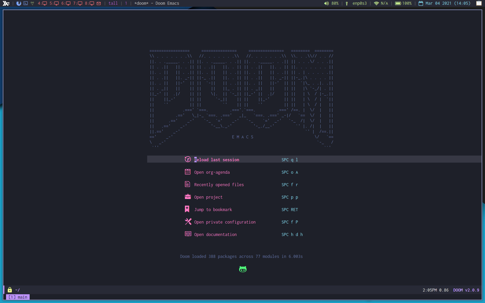

# Arch system

A script to finish setting up my Arch installation. Run it after you installed
the base system and have a working network connection.

First, edit and run `create_user.sh` if you have not created your user.

Then, log into your new user and run `setup.sh` to install and configure the
rest of the system.

## Screenshots

